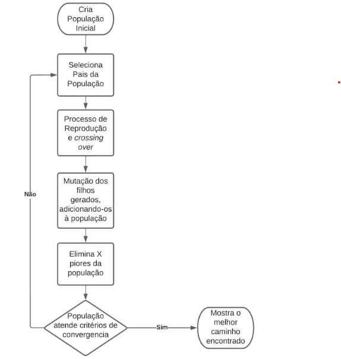

# O Problema do Caixeiro Viajante

O problema do caixeiro viajante é um problema do tipo NP-Difícil, que se enuncia da seguinte forma: Dados pontos (cidades), determinar o menor caminho que passe por todos os pontos uma única vez e termine no ponto inicial. Este problema é baseado na necessidade de transportadoras, varejistas e caixeiros viajantes realizarem entregas em varias cidades diferentes optando pelo caminho em que mais economizarão tempo e recursos. Por ter uma abordagem em otimização combinatória, o problema é um excelente meio de testar algoritmos de otimização, como: colonia de formigas, colonia de morcegos, algoritmo genético, annealing ...  

Este projeto consiste em desenvolver o problema em python e analisar o comportamento de cada algoritmo, usando a biblioteca pygame para interface do sistema.

Ao iniciar o programa, 10 pontos serão gerados aleatoriamente (ou o valor que estiver contido na variavel `nr_de_pontos`)

### Algoritmo de Força Bruta

No caso trivial, este algoritmo verifica cada caminho possivel através da permutação de caminhos, o numero das possiveis combinações é n!, sendo n o numero de pontos do problema. Neste caso, temos 10 pontos e 3.628.800 caminhos possiveis. Para as primeiras iterações temos resultados inconvenientes:

As retas em verde mostram o menor caminho calculado no momento, as retas em branco mostram o caminho que está sendo calculado na atual iteração. Após varias iterações é possivel ver uma solução tomando forma:

Visto que o numero de iterações desse algoritimo é igual ao numero de caminhos possiveis do problema, se tivermos um numero alto de pontos n, os caminhos serão processados até n!. O que o torna ineficiente e computacionalmente custoso para problemas mais elaborados, apesar de sua simplicidade lógica.

### Algoritmo genético

Em 1975, John H. Holland publicava *Adaptation in natural and artificial systems*, livro pioneiro nos algoritmos genéticos, que se baseiam na teoria neodarwinista para encontrar soluções em problemas de otimização combinatória. A teoria neodarwinista explica como surgem novas espécies através de tres pilares:

- Todo ser vivo se reproduz ao alcançar a fase reprodutiva
- Na reprodução, ocorre mutação. (Erro gerado pela combinação de proteínas)
- A seleção natural elimina aqueles que não alcançaram a fase reprodutiva.
    
O algoritmo segue o seguinte esquema:

No caso, cada individuo da população inicial representa um caminho aleatório e cada caminho é uma sequencia de pontos. A seleção dos pais depende do calculo de fitness de cada individuo da população, ou seja, o quão boa é a solução. Decidi calcular esse fitness como 1/d, sendo d a distancia euclidiana do caminho, pois queremos minimizar o caminho percorrido. Após dividir cada fitness pela soma de todos os outros, teremos a probabilidade de cada individuo ser selecionado e gerar outros individuos. 

Após selecionados os pais, devemos realizar o *crossing over*, equivalente a reprodução entre os individuos, mas ao invés de recombinarmos proteinas de fitas de DNA, estaremos recombinando sequencias de pontos de cada caminho (individuo). Experimentei três técnicas de crossover, a primeira técnica consistia em sortear dois pontos em ambos os caminhos selecionados e fazer a permutação entre os intervalos gerados desses pontos. Apesar de ser uma manipulação fácil, a taxa de convergencia para caminhos que se cruzam era muito grande (falarei de caminhos cruzados mais pra frente). Com isso em mente, tentei desenvolver a minha propria técnica de crossover. Diferente da primeira técnica, defini o numero de pontos de crossover como variável em função da quantidade de pontos do caminho, e assim permutar todos os intervalos gerados entre os pais. Porém, isso volta a ser um problema O(n!), tornando o tempo de execução inviável. Após uma consulta no artigo *Genetic Algorithms for the Travelling Salesman Problem: A Review of Representations and Operators*[1], notei que o próprio Holland havia criado algumas técnicas de crossover, entre elas, a Simple Inversion Mutation (SIM), em que, sorteados os dois pontos de crossover, inverte-se o interalo do meio. Isso parecia um forte candidato a "desatar o nó" dos caminhos cruzados. Esta terceira tecnica prevaleceu, a ocorrencia de caminhos cruzados diminuiu assim como o tempo para convergencia.

### NOTAS

[1] Larranaga, Pedro & Kuijpers, Cindy & Murga, R. & Inza, I. & Dizdarevic, S.. (1999). Genetic Algorithms for the Travelling Salesman Problem: A Review of Representations and Operators. Artificial Intelligence Review. 13. 129-170. 10.1023/A:1006529012972
